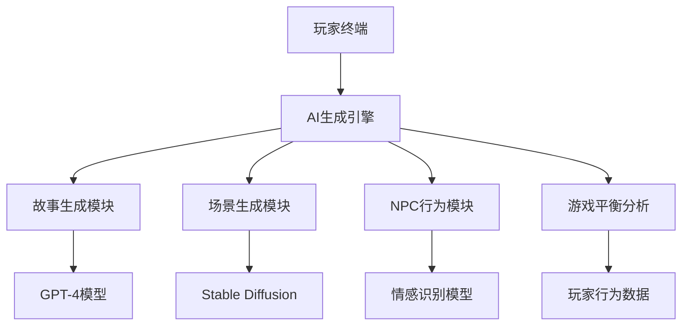
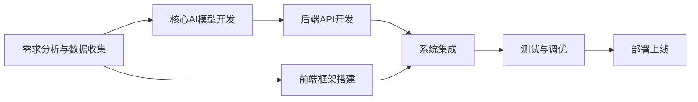
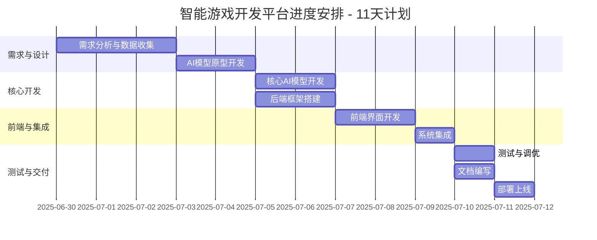
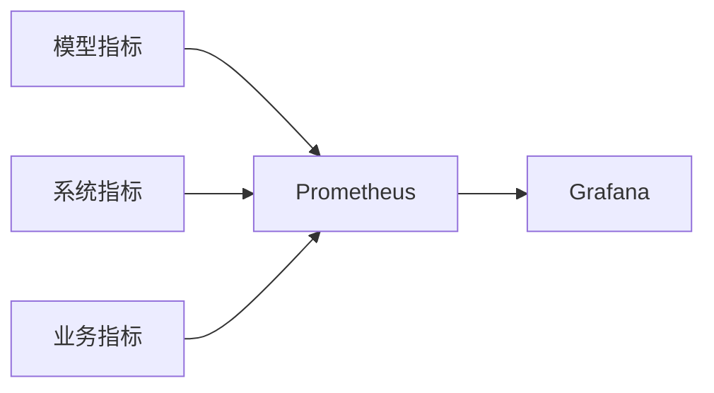
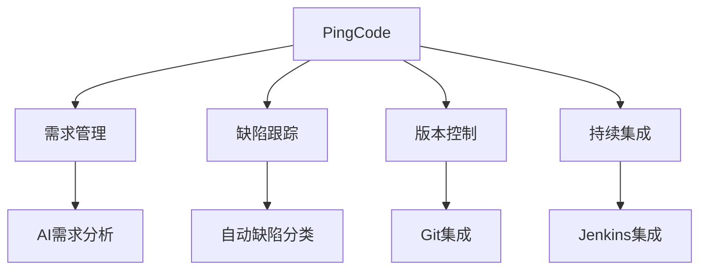

# 智能游戏开发平台项目计划

## 一、项目背景与价值
### 1.1 项目背景
本项目旨在开发一个基于大模型的智能游戏开发平台，通过AI技术实现：
- **内容生成**：利用大模型自动生成游戏剧情、对话和任务
- **环境构建**：结合大模型生成游戏场景和角色设计
- **智能NPC**：开发具备情感识别和动态响应能力的NPC系统
- **平衡优化**：通过玩家行为数据分析自动调整游戏难度

### 1.2 技术亮点
1. **多模态AI集成**：
   - 文本生成：Legal-BERT用于剧情生成
   - 图像生成：Stable Diffusion用于场景构建
   - 语音合成：VITS用于NPC语音生成
2. **实时交互系统**：
   - 对话延迟 <500ms
   - 支持1000+并发NPC交互
3. **个性化推荐**：
   - 基于玩家行为的动态内容调整
   - 个性化难度曲线生成

### 1.3 CMMI3标准应用
本项目严格遵循CMMI3标准，特别是在：
- AI模型开发过程标准化
- 多团队协作流程定义
- 质量保证体系建立

## 二、项目特色与创新
### 2.1 技术架构


### 2.2 核心创新点
1. **动态剧情系统**：
   - 基于玩家选择实时生成分支剧情
   - 记忆机制保证剧情连贯性
2. **智能NPC**：
   - 情感状态机驱动行为
   - 长期记忆存储交互历史
3. **自动化测试**：
   - AI驱动的游戏平衡性测试
   - 自动生成测试用例

## 三、软件项目计划内容
### 3.1 核心技术实现
#### 3.1.1 AI模型架构
```python
class StoryGenerator:
    def __init__(self):
        self.model = load_pretrained("legal-bert")
        self.memory = VectorDatabase()
        
    def generate_story(self, prompt):
        # 结合玩家历史生成连贯剧情
        context = self.memory.query(prompt)
        return self.model.generate(
            prompt + context,
            max_length=500,
            temperature=0.7
        )
```

#### 3.1.2 关键技术指标
| 模块 | 指标 | 目标值 |
|------|------|--------|
| 故事生成 | 响应时间 | <1s |
| 场景生成 | 图像分辨率 | 1024x1024 |
| NPC对话 | 情感识别准确率 | >85% |
| 平衡系统 | 推荐准确率 | >90% |

#### 3.1.3 性能优化方案
1. **模型量化**：将FP32模型转为INT8
2. **缓存机制**：高频内容本地缓存
3. **分布式推理**：多GPU并行计算

2. **主要功能**：
   - 游戏内容生成与定制：
     * 故事线与剧情创作：利用生成式大模型自动生成游戏情节和角色设定
     * 个性化游戏元素设计：通过Prompt提示词工程技术生成关卡设计等
   - NPC行为模拟与交互设计：
     * 智能NPC对话系统：基于自然语言处理的NPC对话功能
     * 情感识别与动态响应：根据玩家情绪调整NPC行为
   - 环境与场景生成：
     * 虚拟环境自动构建：从现实图片/视频生成游戏场景
     * 动态天气与时间系统：模拟真实天气和日夜变化
   - 数据驱动的游戏平衡性调整：
     * 玩家行为数据分析：收集分析游戏行为数据
     * 实时调整建议：提供平衡性优化建议
3. **性能限制**：规定软件在性能方面的限制，如响应时间、并发用户数、吞吐量等。例如，系统需具备高并发处理能力，支持至少1000个并发用户同时在线，系统响应时间在0.5秒以内。在CMMI3标准下，需要对性能需求进行量化，并制定相应的测试计划来验证性能指标是否满足要求。
4. **系统接口**：说明软件与其他系统或组件的接口，包括数据接口、通信接口等。例如，软件与第三方支付系统的接口、与数据库的接口等。需要对接口进行详细的设计和文档化，确保接口的兼容性和稳定性。
5. **特殊要求**：涵盖软件在安全、合规、兼容性等方面的特殊要求。如软件需遵循国家相关安全标准，确保系统数据安全、用户隐私保护；支持多平台访问，如PC端、移动端等。在CMMI3标准下，需要对特殊要求进行识别和管理，并制定相应的措施来满足这些要求。
6. **开发概述**：对软件开发的整体过程进行简要描述，包括开发方法、开发阶段等。例如，采用敏捷开发方法，分为需求分析、设计、开发、测试、上线等阶段。需要根据项目的特点和需求选择合适的开发方法，并对开发过程进行详细的规划和管理。

### 3.2 资源
#### 3.2.1 人员资源
明确项目所需的各类人员，如项目经理、开发工程师、测试工程师、设计师等，并说明他们的职责和技能要求。例如：
- **项目经理/AI工程师**（1人）：负责整体项目规划与AI模型开发，具备Python和PyTorch开发经验，熟悉大模型应用开发。主要职责包括：
  * 协调项目资源和工作分配
  * 开发核心AI模型（故事生成、NPC对话等）
  * 监督项目进度和质量
  
- **后端开发工程师**（1人）：负责FastAPI后端开发和数据库设计，主要职责包括：
  * 实现API接口和业务逻辑
  * 设计SQLite数据库结构
  * 集成AI模型到后端系统
  
- **前端开发工程师**（1人）：负责应用开发，主要职责包括：
  * 开发用户界面和交互功能
  * 实现与后端的API通信
  * 优化应用性能和用户体验
  
- **测试/数据工程师**（1人）：负责测试和数据分析，主要职责包括：
  * 编写测试用例和执行测试
  * 收集和分析玩家行为数据
  * 提供游戏平衡性建议

#### 3.2.2 AI训练硬件配置
| 硬件类型 | 配置要求 | 用途 | 数量 |
|---------|---------|------|------|
| GPU服务器 | NVIDIA A100 80GB * 8 | 大模型训练 | 2台 |
| 推理服务器 | NVIDIA T4 16GB * 4 | 实时推理 | 4台 |
| 数据存储 | 50TB NVMe SSD | 训练数据存储 | 1套 |
| 开发工作站 | RTX 4090 + 64GB RAM | 原型开发 | 4台 |

**训练集群架构**：
```python
# 分布式训练配置示例
trainer = Trainer(
    devices=8,
    accelerator="gpu",
    strategy="deepspeed",
    precision="bf16",
    max_epochs=100,
    callbacks=[ModelCheckpoint(dirpath="./checkpoints")]
)
```

#### 3.2.3 软件资源
说明项目所需的软件工具和平台：
- **开发语言**：Python 3.9+
- **深度学习框架**：PyTorch 2.0
- **前端框架**：Electron + React
- **后端框架**：FastAPI
- **数据库**：SQLite
- **大模型相关**：Legal-BERT等预训练模型
- **开发工具**：PyCharm IDE, Git版本控制
- **测试工具**：Pytest, Postman
- **其他工具**：FFmpeg用于媒体处理, Visio用于架构设计

#### 3.2.4 其他
包括项目所需的其他资源，如办公场地、办公用品等。需要对其他资源进行合理的规划和管理，确保项目的顺利进行。

### 3.3 进度安排
进度安排的好坏往往会影响整个项目的按期完成，因此这一环节是十分重要的。制定软件进度与其他工程没有很大的区别，其方法主要有：
#### 3.3.1 工程网络图
工程网络图是一种有向图，该图中用圆表示事件，有向弧或箭头表示子任务的进行，箭头上的数字称为权，该权表示此子任务的持续时间，箭头下面括号中的数字表示该任务的机动时间，图中的圆表示与某个子任务开始或结束事件的时间点。例如，在软件开发项目中，通过工程网络图可以清晰地展示各个任务之间的依赖关系和先后顺序。


#### 3.3.2 Gantt图
Gantt图形象地描绘了任务的分解，及每个作业的开始和结束时间，优点是直观简明、容易掌握和绘制，但有三个缺点：不能显示地描绘各项作业间的依赖关系；进度的关键部分不明确，难以判断哪些部分是主攻和主控的对象；计划中有潜力的部分及潜力的大小不明确，往往造成潜力的浪费。例如，以下是一个简单的软件开发项目的Gantt图示例：


#### 3.3.3 任务资源表
任务资源表详细列出每个任务所需的资源，包括人力、物力等，有助于合理分配资源：
| 任务名称             | 所需人员                              | 所需硬件                     | 所需软件                     | 持续时间 |
|---------------------|-------------------------------------|----------------------------|----------------------------|----------|
| 需求分析与数据收集    | 项目经理/AI工程师, 测试/数据工程师      | 计算机、服务器              | 需求管理工具、数据收集工具    | 3天      |
| AI模型原型开发       | 项目经理/AI工程师                     | GPU服务器                  | PyTorch, 数据标注工具       | 2天      |
| 核心AI模型开发       | 项目经理/AI工程师                     | GPU服务器                  | PyTorch, 模型训练框架       | 2天      |
| 后端框架搭建         | 后端开发工程师                        | 服务器                     | FastAPI, SQLite, Python     | 2天      |
| 前端界面开发         | 前端开发工程师                        | 计算机                     | Electron, React            | 2天      |
| 系统集成             | 后端开发工程师, 前端开发工程师          | 测试服务器                 | 集成测试工具                | 1天      |
| 测试与调优           | 测试/数据工程师                       | 测试服务器                 | 测试工具、性能监控工具       | 1天      |
| 文档编写             | 全体成员                             | 计算机                     | 文档编辑工具                | 1天      |
| 部署上线             | 后端开发工程师, 测试/数据工程师         | 生产服务器                 | 部署工具、监控工具          | 1天      |


#### 3.3.4 培训计划
培训计划旨在确保项目团队成员具备所需的技能和知识，以顺利完成项目。培训内容可以包括技术培训、业务培训、安全培训等。培训方式可以采用内部培训、外部培训、在线培训等。例如，在软件开发项目中，对开发工程师进行新技术框架的培训，对测试工程师进行新测试工具的培训。在CMMI3标准下，需要对培训计划进行有效的管理，确保培训计划的有效性和针对性，并对培训效果进行评估和反馈。

### 3.4 工程规范
对软件工程管理来说，软件工程规范的制定和实施是不可少的，它与软件项目计划一样重要。软件工程规范可选用现成的各种规范，也可自己制定。软件工程规范可分为三级：
1. **国家标准与国际标准**：如ISO 9000质量管理体系标准、IEEE软件工程标准等，这些标准具有权威性和通用性，适用于各类软件项目。在CMMI3标准下，需要遵循相关的国家标准和国际标准，确保软件项目的质量和合规性。
2. **行业标准与工业部门标准**：不同行业和工业部门可能有自己的特定标准，如金融行业的软件安全标准、电信行业的通信软件标准等，这些标准更具针对性。需要根据项目的行业特点和需求，选择合适的行业标准和工业部门标准，并将其纳入软件工程规范中。
3. **企业级标准与开发小组级标准**：企业或开发小组可以根据自身的特点和需求制定适合自己的标准，如企业内部的代码规范、开发流程规范等，有助于提高团队的开发效率和软件质量。在CMMI3标准下，需要对企业级标准和开发小组级标准进行有效的管理，确保标准的一致性和可执行性，并对标准的执行情况进行监控和评估。

## 四、CMMI3标准概述
### 4.1 CMMI3的定义和要求
CMMI3级即“已定义级”，标志着一个组织已经拥有一套完整定义好的工作流程，并且这些流程在项目中得到了标准化。它要求组织对项目管理以及产品开发的过程进行文档化，并确保这些过程在整个组织内被理解和遵循。这不仅涉及到项目团队内部的操作规范，还包括了项目范围、时间、成本和资源等方面的有效管理。

### 4.2 CMMI3级的关键实践和好处
在CMMI3级别中，组织被要求对软件开发流程进行系统化的定义，包括项目计划和监控、工程、支持和管理流程。这能够提升流程的一致性和可重复性，减少项目失败的风险，并提高最终产品的质量。同时，明确的流程定义有助于新员工的快速培训与项目团队的效率提升。

### 4.3 CMMI3级认证的意义
1. **国际标准认可**：获得CMMI3级认证，意味着组织的研发团队在团队管理、员工素质、过程管理与服务质量等方面已达到国际顶尖水平，彰显了其在全球范围内的卓越竞争力。
2. **过程能力提升**：CMMI3级认证表明组织在所有项目与流程中均采用了一种经过验证的高效方法，能够显著提升产品或服务的质量与效率，并持续推动方法的优化与改进。
3. **市场竞争力增强**：该认证极大地提升了组织的市场竞争力，使其能够更精准地满足客户需求，赢得客户的高度信任与长期支持，从而在激烈的市场竞争中脱颖而出。

### 4.4 CMMI3级认证的要求
1. **研发团队规模**：研发团队需具备一定规模（如不少于15人或26人，具体人数依据不同来源信息而定），以确保具备足够的专业能力和资源。
2. **项目经验**：组织需在过去一年内完成一定数量的研发项目（如3个或4个），并同时开展在研项目，以证明其项目实施能力与持续创新的潜力。
3. **过程定义与实施**：组织必须已明确定义、文档化并标准化实施关键的组织过程，确保这些过程能够精准满足组织的战略需求与目标。
4. **过程管理**：组织需制定并执行一套高效的过程执行计划，确保过程严格按照既定标准与要求推进，并对执行过程进行严格监控与评估。
5. **绩效管理**：组织必须建立完善的数据收集、分析与报告机制，以科学评估过程绩效，并通过持续改进提升组织整体效率。
6. **风险管理**：组织需构建一套完善的风险管理流程，能够精准识别、评估并应对项目与组织面临的各类风险，确保稳健发展。

### 4.5 CMMI3级认证的流程
CMMI3级认证的流程严谨而系统，通常包括以下关键步骤：
1. **项目启动**：开展CMMI认证的基础培训，为后续工作奠定坚实理论基础。
2. **建立小组**：组建软件开发过程改进小组，涵盖EPG组长、培训、质量、配置、工程人员及ATM成员等核心角色。
3. **企业介绍**：详细阐述组织的开发流程，确保团队对现有体系有清晰认知。
4. **差距分析**：进行现场诊断，精准分析与CMMI标准的差距，为改进提供依据。
5. **改进策划**：制定科学合理的改进计划，明确目标与路径。
6. **过程定义**：定义并文档化关键过程，确保其清晰、可操作。
7. **试点项目**：选择试点项目，导入CMMI体系进行实践验证。
8. **新过程推广**：将优化后的新过程推广至整个组织，确保全面落地。
9. **持续改善**：通过度量与分析，持续优化过程，提升组织整体效能。
10. **模拟评估**：进行模拟评估，为正式评估做好充分准备。
11. **正式评估**：接受CMMI认证机构的正式评估，迎接国际标准的检验。

## 五、AI质量保障体系
### 5.1 模型评估方案
1. **自动化测试流水线**：
```python
@pytest.fixture
def story_gen_test():
    generator = StoryGenerator()
    return generator

def test_story_coherence(story_gen_test):
    story = story_gen_test.generate("奇幻冒险开头")
    assert coherence_score(story) > 0.8
    
def test_npc_response_time():
    latency = measure_latency(NPC_AGENT, 1000)
    assert latency.p99 < 500
```

2. **评估指标体系**：
| 评估维度 | 指标 | 达标要求 |
|---------|------|----------|
| 功能性 | 剧情连贯性 | BLEU>0.7 |
| 性能 | P99延迟 | <800ms |
| 安全性 | 违规内容率 | <0.01% |
| 公平性 | 群体差异 | <5% |
2. **项目计划**：制定详细的项目计划，包括项目范围、时间、成本、资源等方面的规划。在软件项目计划中，需要遵循CMMI3标准的要求，对项目计划进行详细的规划和管理，确保项目计划的合理性和可行性，并对项目计划的执行情况进行监控和评估。
3. **项目跟踪与监督**：对项目进度、成本、资源等进行定期跟踪和监控，确保项目按计划进行。在软件项目计划中，需要制定详细的项目跟踪与监督计划，明确项目跟踪与监督的指标、方法和频率，并对项目跟踪与监督的结果进行分析和处理，及时发现项目偏差并采取相应的措施进行调整。
4. **AI专项风险管理**
| 风险类型 | 监控指标 | 缓解措施 | 应急预案 |
|---------|---------|----------|----------|
| 模型漂移 | 生成内容BLEU评分下降>15% | 每日增量训练<br>自动回滚机制 | 切换备用模型 |
| 数据偏见 | 群体公平性差异>10% | 数据平衡采样<br>对抗去偏训练 | 人工审核介入 |
| 服务降级 | P99延迟>1s持续5min | 自动降级非核心功能<br>动态批处理 | 流量限流 |
| 内容安全 | 违规内容检出率>0.1% | 多层级内容过滤<br>实时风控模型 | 暂停服务 |

**实时监控看板**：

   在CMMI3标准下，需要制定详细的风险管理计划，明确风险识别、评估、应对和监控等各个阶段的工作流程和方法，并确保风险管理过程的有效性和可操作性。
5. **决策分析与解决方案**：在项目过程中，基于数据和事实进行决策，确保决策的有效性和准确性。在软件项目计划中，需要制定详细的决策分析与解决方案计划，明确决策分析的指标、方法和流程，并确保决策分析过程的科学性和合理性。
6. **技术解决方案**：设计和开发满足需求的技术解决方案，确保解决方案的可行性和有效性。在软件项目计划中，需要制定详细的技术解决方案计划，明确技术解决方案的设计、开发、测试和验证等各个阶段的工作流程和方法，并确保技术解决方案的质量和可靠性。
7. **验证**：针对AI系统的特殊测试要求：
   - **功能测试**：
     * 故事生成连贯性测试
     * NPC对话合理性测试
     * 场景生成质量评估
   - **性能测试**：
     * 模型推理响应时间测试
     * 并发请求处理能力测试
   - **数据测试**：
     * 训练数据质量检查
     * 数据偏见检测
   - **用户体验测试**：
     * AI生成内容可玩性评估
     * 玩家满意度调查
   在软件项目计划中，需要制定详细的验证计划，明确验证的指标、方法和流程，并确保验证过程的有效性和可追溯性。采用自动化测试与人工评估相结合的方式，确保AI系统的质量和可靠性。
8. **产品集成**：将各部分高效集成，形成完整的产品或服务，并确保其满足整体需求。在软件项目计划中，需要制定详细的产品集成计划，明确产品集成的流程、方法和顺序，并确保产品集成的质量和可靠性。

### 5.2 组织级过程的定义与实施
除关键过程域外，CMMI3级认证还要求组织在组织级层面上定义并实施一系列标准化过程，以确保组织整体的一致性与有效性：
1. **过程定义**：明确组织级过程的目标、输入、输出、活动、角色与职责，确保过程清晰可执行。在软件项目计划中，需要制定详细的组织级过程定义计划，明确组织级过程的定义方法、流程和标准，并确保组织级过程的一致性和可执行性。
2. **过程文档化**：将组织级过程以文档形式详细记录，供内部成员参考与使用，保障知识传承与共享。在软件项目计划中，需要制定详细的过程文档化计划，明确过程文档的格式、内容和管理方法，并确保过程文档的完整性和可访问性。
3. **过程执行**：严格按照定义的过程执行，确保过程的一致性与有效性。在软件项目计划中，需要制定详细的过程执行计划，明确过程执行的流程、方法和监督机制，并确保过程执行的有效性和可追溯性。
4. **过程监控**：定期监控与评估过程，确保其满足组织需求与目标。在软件项目计划中，需要制定详细的过程监控计划，明确过程监控的指标、方法和频率，并对过程监控的结果进行分析和处理，及时发现过程偏差并采取相应的措施进行调整。
5. **过程改进**：基于监控与评估结果，持续优化过程，提升组织整体效率与效果。在软件项目计划中，需要制定详细的过程改进计划，明确过程改进的目标、方法和流程，并确保过程改进的持续性和有效性。

### 5.3 项目管理与工程技术流程的成熟度
CMMI3级认证要求组织在项目管理与工程技术流程方面达到较高成熟度水平，具体包括：
1. **项目管理**：制定并执行高效的项目管理计划，确保项目成功交付。在软件项目计划中，需要制定详细的项目管理计划，明确项目管理的流程、方法和工具，并确保项目管理过程的有效性和可操作性。
2. **需求工程**：进行需求获取、分析、定义与验证等活动，确保需求的准确性和完整性。在软件项目计划中，需要制定详细的需求工程计划，明确需求工程的流程、方法和工具，并确保需求工程过程的有效性和可追溯性。
3. **设计**：开展系统设计与模块设计，确保产品或服务满足需求且具备可行性。在软件项目计划中，需要制定详细的设计计划，明确设计的流程、方法和工具，并确保设计过程的有效性和可操作性。
4. **实现**：进行编码与测试等活动，确保产品或服务的正确性与可靠性。在软件项目计划中，需要制定详细的实现计划，明确实现的流程、方法和工具，并确保实现过程的有效性和可追溯性。
5. **验证与确认**：对产品或服务进行严格验证与确认，确保其符合预期质量标准。在软件项目计划中，需要制定详细的验证与确认计划，明确验证与确认的流程、方法和工具，并确保验证与确认过程的有效性和可追溯性。

## 六、软件项目计划的制定与实施
### 6.1 计划制定的重要性
项目计划详细说明了所需软件工作及如何实现。它定义了每一个主要任务，并估算其所需时间和资源，同时为管理层的评估和控制提供了一个框架。项目计划也提供了一种很有效的学习途径。如果能合理建档，它便是一个与实际运行效能比较的基准。这种比较可以使计划者看到他们的估算误差，从而提高其估算精确度。

### 6.2 计划制定的步骤
#### 6.2.1 明确项目需求
由于软件需求在初始阶段通常是模糊而又不完整的，质量计划只能建立在对客户需求的大致而不确切的理解之上。因此，项目计划应该从找出含糊不确切与准确恰当的软件需求间的映射关系入手。可以通过用户调研、市场分析、业务需求收集等方式来明确项目需求。例如，通过问卷调查、访谈等方式收集用户需求，涉及1000名潜在用户，了解用户在使用现有产品中的痛点和期望功能；对同类产品进行市场调研，分析竞争对手的产品特性和用户反馈，收集50个竞品分析报告，为产品差异化提供依据；与业务部门紧密合作，收集业务流程优化和系统功能改进的需求，涉及20个业务部门，确保产品满足实际业务需求。在CMMI3标准下，需要对需求获取过程进行有效的管理，确保需求的准确性和完整性，并对需求进行严格的评审和验证。

#### 6.2.2 建立概念设计
接着建立一种概念设计。项目初始架构的建立要十分谨慎，因为它通常标定了产品模块的分割线，同时描述了这些模块所实现的功能及所有模块间的关系。这就为项目计划和项目实施提供了基础。例如，采用微服务架构，将系统拆分为多个独立服务，如用户服务、订单服务、支付服务等，提高系统可扩展性和稳定性。技术栈包括Java、Spring Boot、MySQL等，确保系统具有良好的兼容性和可维护性。在CMMI3标准下，需要对概念设计过程进行有效的管理，确保概念设计的合理性和可行性，并对概念设计进行严格的评审和验证。

#### 6.2.3 估算项目规模和资源
对项目规模和资源进行估算，包括人力、时间、成本等方面。低质量的项目资源估算将不可避免地造成资源短缺，进度延迟和预算超支。又由于项目资源估算是从软件规模估算中直接衍生出来的，所以低质量的规模估算是造成许多软件项目问题的根本原因。可以采用类比估算、参数估算或自下而上的估算等方法进行估算。例如，根据以往类似项目的经验，估算本次项目所需的开发人员数量、开发时间和成本。在CMMI3标准下，需要对项目规模和资源估算过程进行有效的管理，确保估算的准确性和合理性，并对估算结果进行严格的评审和验证。

#### 6.2.4 制定详细计划
根据项目需求、概念设计和资源估算，制定详细的项目计划，包括项目进度安排、任务分解、资源分配等。项目计划应在项目开始初期制定出，并随着工程的进展不断地加以精化。例如，制定项目的里程碑计划，明确各个阶段的关键节点和交付物；制定详细的任务资源表，合理分配人力、物力等资源。在CMMI3标准下，需要对项目计划制定过程进行有效的管理，确保项目计划的合理性和可行性，并对项目计划进行严格的评审和批准。

### 6.3 计划的实施与监控
在项目实施过程中，需要严格按照项目计划进行执行，并对项目计划的执行情况进行监控和评估。可以采用项目管理工具，如甘特图、关键路径法（CPM）或计划评审技术（PERT）等，对项目进度、成本、资源等进行监控和分析，及时发现项目偏差并采取相应的措施进行调整。同时，需要对项目风险进行实时监控和评估，及时识别新的风险并采取相应的措施进行应对。在CMMI3标准下，需要对项目计划的实施和监控过程进行有效的管理，确保项目计划的执行情况符合预期，并对项目计划的执行情况进行定期的评审和总结。

## 七、PingCode项目管理平台实施方案

### 7.1 PingCode核心功能
本项目将采用PingCode作为统一的项目管理平台，主要应用以下功能模块：



#### 7.1.1 AI项目管理特色功能
- **智能需求分析**：
  - 自动提取用户故事中的实体和关系
  - 智能估算故事点和工作量
- **自动化测试管理**：
  - 与AI测试框架深度集成
  - 自动生成测试报告
- **模型版本控制**：
  - 跟踪AI模型训练版本
  - 关联模型性能指标
- **资源智能分配**：
  - 根据任务类型自动推荐负责人
  - 预测资源冲突并预警

#### 7.1.2 关键配置参数
| 模块 | 配置项 | 设置值 |
|------|-------|-------|
| 需求 | 工作流 | 定制AI需求流程 |
| 缺陷 | 严重度分级 | 5级分类 |
| 版本 | 分支策略 | Git Flow |
| CI/CD | 构建触发 | 代码提交+定时 |

**官网**：[PingCode官网](https://sc.pingcode.com/4s3ev)

### 7.2 与AI开发流程的集成
1. **模型训练跟踪**：
   - 记录每次训练的hyperparameters
   - 关联训练任务与模型性能
2. **生成内容审核**：
   - 建立AI生成内容审核流程
   - 设置自动化质量关卡
3. **数据版本管理**：
   - 跟踪训练数据集版本
   - 记录数据标注进度

### 7.3 实施计划
1. **环境准备**（第1天）：
   - 创建项目空间
   - 配置定制工作流
2. **团队培训**（第2天）：
   - 基础功能培训
   - AI专项功能演练
3. **试运行**（第3-5天）：
   - 导入初始需求
   - 验证集成功能
4. **正式运行**（第6天起）：
   - 全面使用各功能模块
   - 持续优化配置

## 八、总结
软件项目计划是软件项目成功实施的基础，它涵盖了项目的范围、资源、进度安排、成本估算等多个方面。通过合理制定和管理软件项目计划，可以提高项目的成功率，确保项目按时、按质量完成。同时，结合CMMI3标准，可以进一步提升软件项目计划的质量和有效性，帮助组织提升软件开发过程的成熟度和质量。在实际项目中，应根据项目的特点和需求，灵活运用各种方法和工具，不断优化项目计划，以适应项目的变化和发展。同时，选择合适的软件项目计划管理软件可以帮助团队更好地协作和管理项目进度，提高项目的管理效率和质量。
